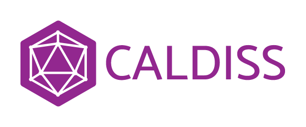

This is the repository page for the PhD Course 
`Social Data Science: An Applied Introduction to Machine Learning`

`powered by`



   &ensp;&ensp; 
 
 


## NOTE: This course will be held entirely online!

Due to the continued COVID-19 precautions, this course will now be held entirely online. Read more on our [practical information page]().

## Deadline for portfolio hand-in is on December 11th!

Read more about portfolio requirements and how to hand in [here]().

